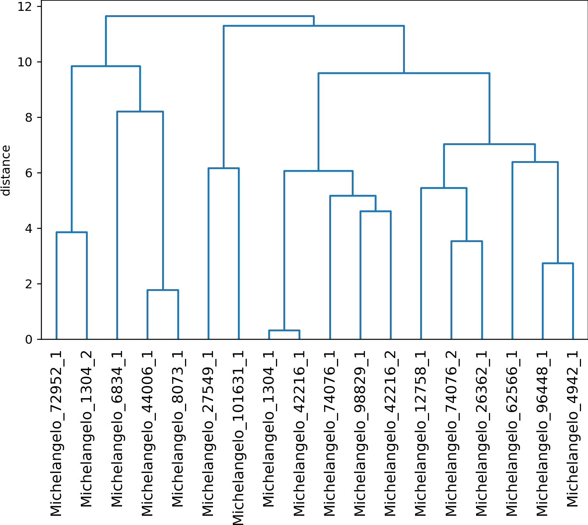

# Pose Analysis

## Style over history

<p float="left">
    
</p>

## Nude paintings over styles

<p float="left">
    
</p>

## Nude paintings over artists

<p float="left">
    
</p>

## FLIC annotations

<p float="left">
    
</p>

## Human parsing

```bash
python demo_human_parsing.py --input dataset/painter-of-modern/Felix\ Vallotton\ /Magic\ Realism/7043.jpg --model models/lip_jppnet_384.pb
```

<p float="left">
    
    
</p>

## Openpose

```bash
python demo_openpose.py --input dataset/painter-of-modern/Felix\ Vallotton\ /Magic\ Realism/7043.jpg --proto models/openpose_pose_coco.prototxt --model models/pose_iter_440000.caffemodel --dataset COCO
```

<p float="left">
    
    
</p>

## tf-pose

python 3.6 + tensorflow 1.15 + tf-pose, as tf-pose works only with tensorflow < 2.0
```bash
conda create -n py3.6 python=3.6
conda activate py3.6
pip install tensorflow==1.15
pip install tf-pose
```

```bash
python demo_tfpose.py --input dataset/painter-of-modern/Felix\ Vallotton\ /Magic\ Realism/7043.jpg
```

<p float="left">
    
    
</p>

## Analyze poses

1. In [Openpose](https://github.com/tintinrevient/openpose), execute the following command and copy 'output' folder here;
```bash
python extract_keypoints_pyopenpose.py --input datasets/
```

2. Execute the following command to generate:

* For each valid person: bbox + normalized pose;
* For all valid people: angle CSV file to generate the dendrogram later;

```bash
python analyze_keypoints.py --input output/data/
```

<p float="left">
    
    
    
    
    
    
</p>

<p float="left">
    
</p>

3. Execute the following command to generate the dendrogram:
```bash
python hierarchical_clustering.py
```

<p float="left">
    
</p>

## References
* https://kanoki.org/2019/11/12/how-to-use-regex-in-pandas/
* https://datatofish.com/string-to-integer-dataframe/
* https://www.kaggle.com/akshaysehgal/how-to-group-by-aggregate-using-py
* https://matplotlib.org/stable/gallery/lines_bars_and_markers/horizontal_barchart_distribution.html
* https://towardsdatascience.com/data-science-with-python-intro-to-loading-and-subsetting-data-with-pandas-9f26895ddd7f
* https://github.com/facebookresearch/detectron2/issues/300
* https://github.com/facebookresearch/detectron2/blob/master/GETTING_STARTED.md#inference-with-pre-trained-models
* https://kegui.medium.com/how-do-i-know-i-am-running-keras-model-on-gpu-a9cdcc24f986
* https://detectron2.readthedocs.io/en/latest/tutorials/models.html
* https://detectron2.readthedocs.io/en/latest/notes/benchmarks.html
* https://dbcollection.readthedocs.io/en/latest/datasets/flic.html
* https://bensapp.github.io/flic-dataset.html
* https://www.tensorflow.org/datasets/catalog/flic
* https://www.mathworks.com/help/matlab/matlab_external/install-the-matlab-engine-for-python.html
* https://www.mathworks.com/help/matlab/ref/matlabroot.html
* https://matplotlib.org/stable/gallery/color/named_colors.html
* https://matplotlib.org/2.1.2/api/_as_gen/matplotlib.pyplot.plot.html
* https://github.com/opencv/opencv/blob/master/samples/dnn/openpose.py
* https://docs.opencv.org/3.4/d7/d4f/samples_2dnn_2openpose_8cpp-example.html
* https://github.com/opencv/opencv/blob/master/samples/dnn/human_parsing.py
* https://www.tensorflow.org/install/pip
* https://pypi.org/project/tf-pose/
* https://github.com/CMU-Perceptual-Computing-Lab/openpose/issues/1273
* https://github.com/lara-unb/openpose/blob/master/doc/output.md#pose-output-format
* https://github.com/tintinrevient/openpose/blob/master/doc/02_output.md#keypoint-format-in-datum-advanced
* https://github.com/CMU-Perceptual-Computing-Lab/openpose/blob/master/include/openpose/pose/poseParametersRender.hpp
* https://github.com/gedeck/practical-statistics-for-data-scientists